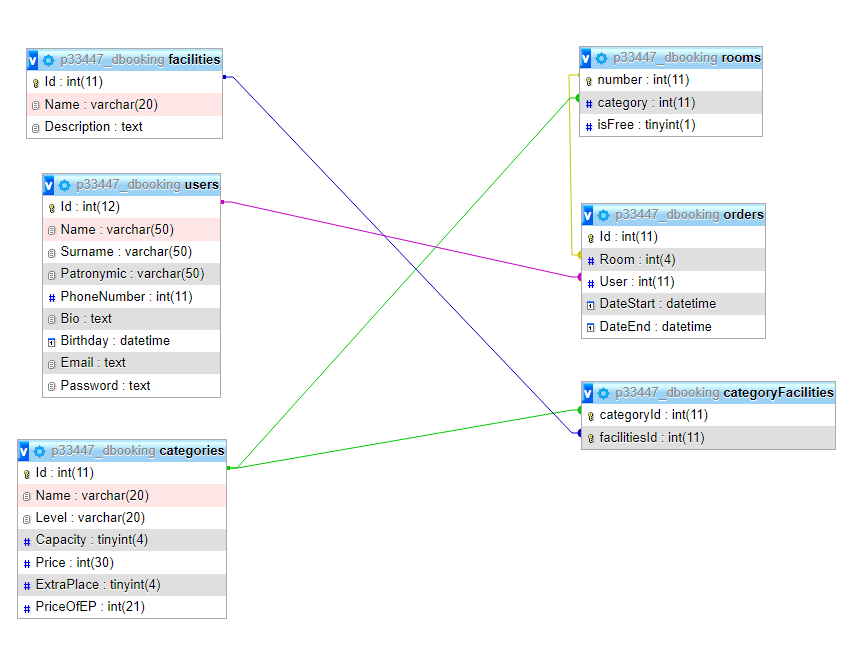

# Курсовая работа HotelReservationIS
--------------------------
### Цель работы

Разработать информационную систему для бронирования номерова в отеле

--------------------------
#### Описание системы

Система состоит из трех разделов:
* База данных
* BackEnd (Уровень бизнес логики)
* FrontEnd (Пользовательский интерфейс)

Система предоставляет следующие возможности:
* Бронирование номеров в отеле
* Просмотр предыдущих заказов
* Просмотр информации о номерах
* Регистрации пользователя в системе

Пользователь может зарегестрроваться в системе используя кнопку `Зарегистрироваться`, после этого он должен заполнить следующие поля:
* Имя
* Номер телефона
* e-mail
* Пароль

После регистрации пользователь может войти в систему используя кнопку `Войти` и, введя e-mail и корректный пароль.

По клику по одному из предоставляемых номерова открывается страница с подробным описанием номера и формой бронирования

###### Опиcание содержит:
* Динамически обновляемое количество свободных номеров данного типа
* Цену номера
* Удобства находящиеся в номере

Для бронирования номера необходимо нажать кнопку `Забронировать` предварительно выбрав даты бронирования, в случае отсутвия свободных номеров пользователь получит уведомление об этом.

Также после входа на сайт пользователю становится доступна информация об аккаунте, которая содержит список предыдущих заказов, для открытия страници с информаией необходимо кликнуть на имя пользователя в правом верхнем углу.

--------------------------
#### Ход работы

Разработка системы должна проводиться по одному двух сценариев:
* Сверху вниз
* Снизу вверх

Однако ввиду ограниченности во времени сначала была разработана база данных, на основе данных которые будут храниться в системе был разработан пользовательский интерфейс. Финальным этапом была разработка урованя бизнес логики и взаимодейсти между бизнес логикой и пользовательским интерфейсом.

###### Используемый стек технологий:
* Apache 2.4.41
* PHP 7.4.3 (Developing 8.1.1)
* JavaScript
* MySQL 8.0.27
* JQuery 3.6.0
* Bootstrap 5.1.3

Для размещения искользовался выделенный сервер предоставляемы ресурсом [DigitalOcean](https://www.digitalocean.com/). Доменное имя было предоставлено ресурсом [No-Ip](https://www.noip.com/).

Увидеть выполненную работу можно по адресу [anselet.sytes.net](http://anselet.sytes.net/)

--------------------------

## Структура базы данных:

